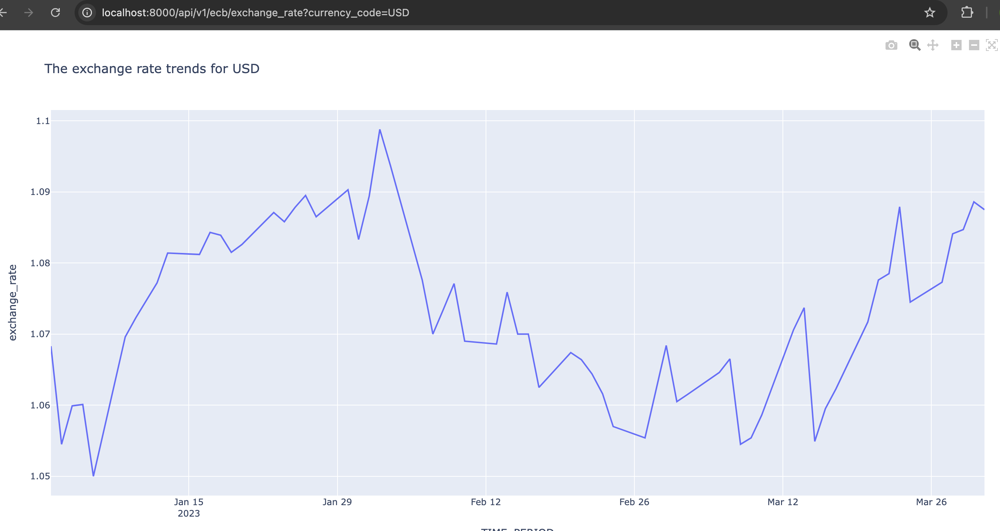

# ecb exchange rate data pipeline

[](https://github.com/JohnOMDev/ecb_exchange_rate/actions/workflows/fastapi-app.yml)
[](https://github.com/PyCQA/bandit)
[](https://github.com/psf/black)

# Data Pipeline

This project is a pipeline for ingesting, transforming, and visualizing data. It reads data from ecb api, processes it, exports it to both a database and the file system for analysis, calculates the potential order amount, and visualizes the results.

## Project Structure

- `.github`: Contains workflows for continous integration (CI).
- `docker`: Directory with the Dockerfile for building the container image, Docker Compose files, and environment variables.
- `scripts`: Contains SQL queries for creating objects required for analytical processing.
- `ecb_pipeline`: Main project directory housing the application code, including ingestion, transformation, and data loader in src, and analytics in v1.
- `test`: Contains unit tests and other test-related files.
- `poetry.lock`: Lock file for managing project dependencies.
- `Makefile`: Defines commands for automating tasks.
- `pyproject.toml`: Configuration file for project dependencies and settings.
- `README.md`: Provides an overview and documentation for the project.

## Setup

### Prerequisites

- Docker
- Docker Compose

### Installation


#### Run Locally
1. **Use Python 3.11**:
   Ensure you have Python 3.11 installed.

2. **Install `pipx`**:
   Follow the instructions [here](https://github.com/pypa/pipx#install-pipx) to install `pipx`.

3. **Install Poetry**:
   Install Poetry (dependency manager) using:
   ```sh
   pip install poetry
    ```
4. **Clone the Repository:**

    ```sh
    git clone https://github.com/JohnOMDev/ecb_exchange_rate.git
    ```
5. **change directory**:
   ```sh
   cd ecb_exchange_rate
    ```
6. **Install the dependencies**:
   Install dependency manager using:
   ```sh
   poetry update
    ```
7. **Activate the vitual enviroment**:
   Activate Poetry (dependency manager) using:
   ```sh
   poetry shell
    ```

8. **Export the environment varaible in your terminal**:
    ```sh
    export sunday_db_password="..."
    export sunday_db_user="...."
    export sunday_dbname="...."
    export sunday_db_host="...."
    ```
9. **Run locally:**

    ```sh
    uvicorn ecb_pipeline.app:app --proxy-header --host 0.0.0.0 --port 8080
    ```

#### Run using docker

1. **Run locally:**

    ```sh
    docker volume create ecb_data
    ```

2. **Start the Docker Containers**

    ```sh
    make docker-compose
    ```

## Usage

### Pipeline Execution

The pipeline reads data from Parquet files, performs necessary transformations, and saves the results to a PostgreSQL database.

### Query and Visualization

After the data has been processed, you can query and visualize the results.

1. **Access Fast API UI:**
    FastAPI is used for accessing, controlling, and testing the pipeline. The FastAPI dashboard for the data pipeline can be accessed at http://0.0.0.0:8000/docs or http://localhost:8000/docs.
    

    
1. **Access the Database:**

   You can connect to the PostgreSQL database using a client tool like `psql` or any GUI client. Use the credentials provided in `.env`.

2. **Run SQL Queries:**

   Use SQL queries to aggregate and analyze the data. For example, to analyze revenue trends over time (daily, weekly, monthly).:

    ```sql
        SELECT 
            order_date, 
            SUM(revenue) AS daily_revenue
        FROM orders
        GROUP BY order_date
        ORDER BY order_date;
    ```

## Testing

1. **You can test each unit or the full converage (the test can only be performed when running in local mode)**
    Full Coverage test
    ```sh
    make test
    ```
    Unit Test
    ```sh
    make test_s1
    ```
2. **Linting** 
    ```sh
    make lint
    ```
3. **Formating**
    ```sh
    make format
    ```
4. **Security** 
    
    ```sh
    make security
    ```

## Performance Optimization

I consider the following optimization strategies considering the time and resources available:

- **Data Chunking:** Divide data into manageable partitions to prevent memory overload.
- **Efficient Queries:** Optimize SQL queries to enhance performance.
- **Parallel Processing:** Accelerate data ingestion using parallel processing techniques.
- **Columnar File Format and In-Memory Processing** Leverage DuckDB and Parquet’s columnar file format for efficient in-memory data processing.

## TODO
- Retrieve the exchange rate for holidays and weekends by using the rate from the previous working day.

## Documentation

For detailed documentation on data handling and the usage of libraries like DuckDB, Parquet refer to their official documentation:

- [DuckDB Documentation](https://duckdb.org/docs/)
- [PostGres Documentation](https://postgres.net/docs/)
- [Poetry for python dependency management](https://python-poetry.org/)

## License

This project is licensed under the MIT License. See the `LICENSE` file for details.

## Contact

For any questions or issues, please contact [John Omole](mailto:contact@johnomole.me).
